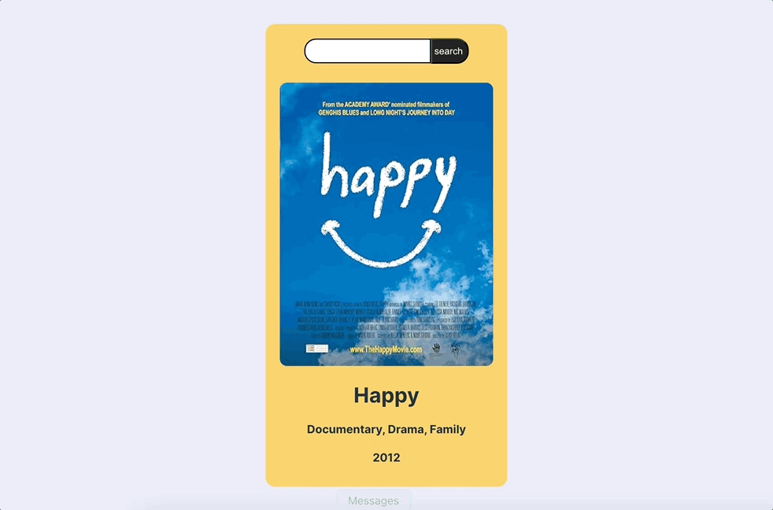

# GLAB 320H.7.1 - React Movie Search

## 🎯 Learning objectives

- Use vite as `create-react-app` is now deprecated by the React Team
- Use `npm create vite@latest`
- Use the `useEffect` React hook
- Implement the lifting state pattern in React
- Bind React components to user input elements
- Make external API requests within a React application

## 🔗 API

- I used OMDB API: http://www.omdbapi.com/

## 🚀 React + Vite

This app was built with React working in Vite.

Currently, two official plugins are available:

- [@vitejs/plugin-react](https://github.com/vitejs/vite-plugin-react/blob/main/packages/plugin-react/README.md) uses [Babel](https://babeljs.io/) for Fast Refresh
- [@vitejs/plugin-react-swc](https://github.com/vitejs/vite-plugin-react-swc) uses [SWC](https://swc.rs/) for Fast Refresh
